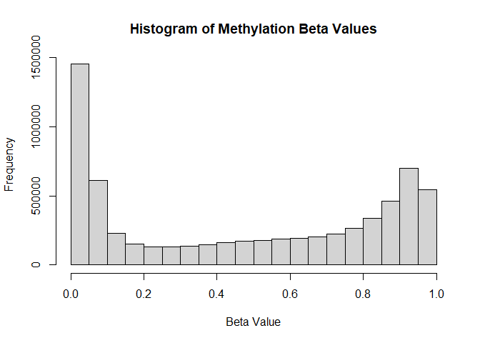
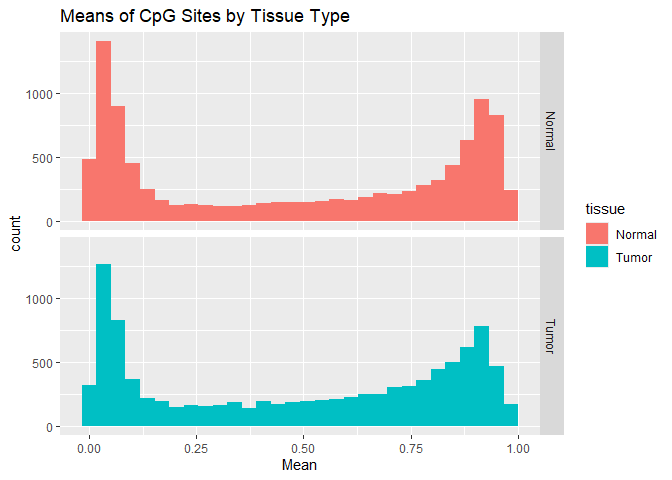
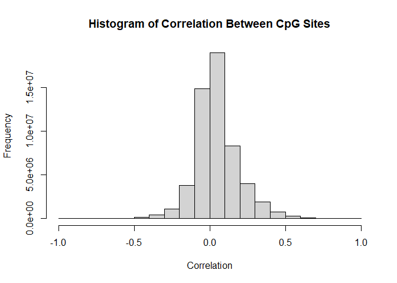
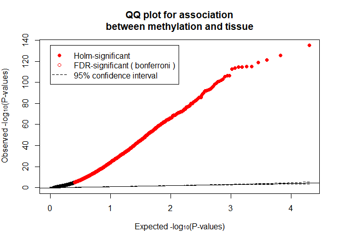
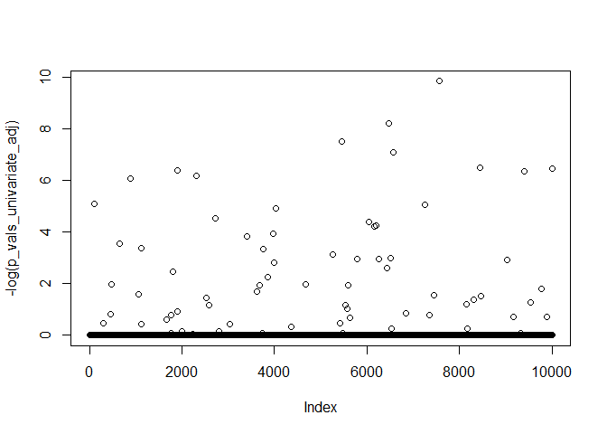
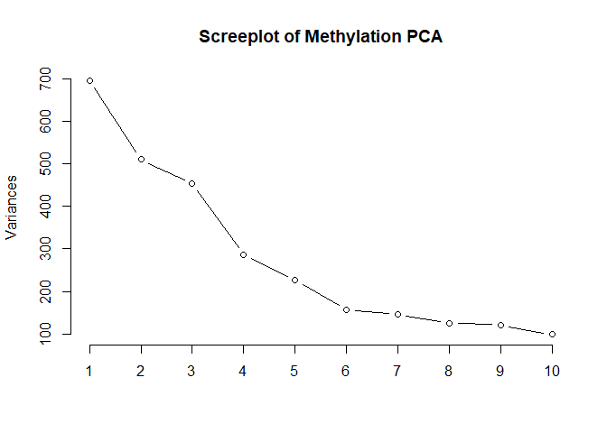
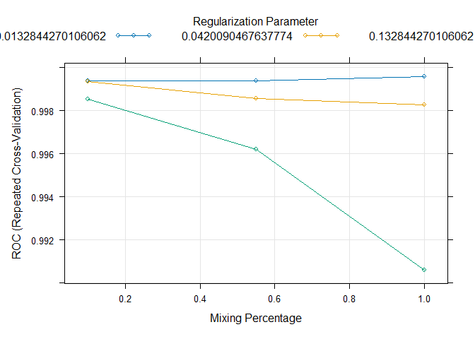
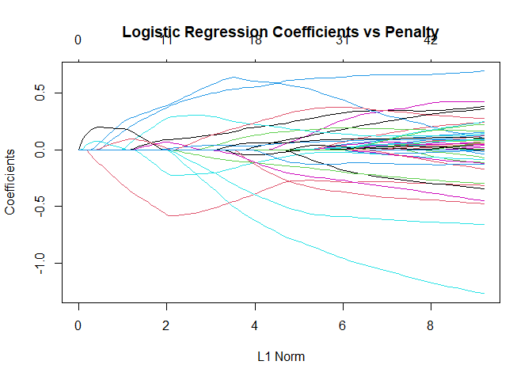

Epigenome-Wide BRCA Analysis
================

## Introduction

In this project, I explore the relationship between CpG site methylation
and status as a tumor or a normal-adjacent tissue from the TCGA-BRCA
breast cancer data set. In the data-set, there are 895 samples from 791
unique individuals. There are 798 tumor samples and 97 normal-adjacent
samples. Normal-adjacent samples are taken from a cancerous patient from
a non-tumorous region of their body. For analysis, I considered a
matched control design, wherein normal-adjacent samples from each
patient would serve as the control, but instead I opted for a
non-matched case/control design for the increased power allowed by in
the increased sample size of including the tumor samples without a
matched control.

The data was sourced from the Illumina 450k Methylation assay, a
technology that quantifies the methylation at approximately 450,000 CpG
sites across the genome. The platform uses bisulfite sequencing to
differentiate methylated and unmethylated regions2. DNA is sequenced
before and after the application of bisulfites to the CpG site of
interest. CpG sites that are unchanged by this process are likely to be
methylated. If the cytosine in the CpG site is changed into thymine,
then that site is likely un-methylated. Methylation protects the DNA
strand. Two probes are then used to detect any change in the nucleotide.
The number of cells in the sample with changed and unchanged nucleotides
are counted. The beta value for the CpG site is calculated as the
percentage of cells whose nucleotide was changed by the bisulfite
process3. In this data-set, the beta values have been calculated. Due to
computational constraints, I randomly selected a subset of 10,000 CpG
sites across the genome.

In this analysis, I will explore the relationship between CpG site
methylation and sample case/control status. I will begin with a
univariate analysis, where each CpG site is evaluated separately. In
order to leverage the signals of multiple CpG sites, I will create a
penalized logistic regression model with an elastic net penalty. In
order to visualize the large scale of the data, I will use principle
component analysis (PCA) to create two-dimensional graphics.

My analysis found strong evidence of association between methylation and
case/control status. The univariate analysis found twenty-four sites to
be significant, and the logistic regression model found ten sites to be
significant, three of which overlapped with the univariate analysis.

## Data Preparation

Data was downloaded from the National Cancer Institute via the
TCGABiolinks R package. 10,000 CpG sites across the epigenome were
randomly selected for analysis. The sampled CpG sites are spread across
the genome. The data is bimodal, as expected. At a high level, the
differences between mean methylation of CpG sites between normal and
tumor tissues are not immediately discernible. However, the tumorous
tissue appears to have a higher overall variance than the normal tissue.
The methylation of most CpG sites are uncorrelated. While adjacent CpG
sites are often highly correlated, the 10,000 sites in this sample were
randomly sampled from across the genome, and any two CpG sites in the
analysis are not likely to be neighbors.

``` r
# data download
library(TCGAbiolinks)
library(SummarizedExperiment)
library(tidyverse)
library(DT)

# analysis
library(CpGassoc)
library(glmnet)
library(caret)
library(pROC)
```

### Downloading Data

``` r
query_met <- GDCquery(
    project = "TCGA-BRCA",
    data.category = "DNA Methylation",
    platform = c("Illumina Human Methylation 450")
)

# Get all patients that have DNA methylation 
patients = substr(getResults(query_met, cols = "cases"), 1, 12)

query_met <- GDCquery(
    project = "TCGA-BRCA",
    data.category = "DNA Methylation",
    data.type = 'Methylation Beta Value',
    platform = c("Illumina Human Methylation 450"),
    barcode = patients
)

# download
GDCdownload(query_met, files.per.chunk = 1)

# combining data
GDCprepare(query_met, save = TRUE, save.filename = "TCGA_BRCA_Methylation_4.1.RData")
```

### Data Processing

``` r
# load downloaded data
load('TCGA_BRCA_Methylation_4.1.RData')

# Methylation beta values
df = 
  SummarizedExperiment::assays(data)[[1]] |> 
  as.data.frame()

# get a simple survey of which sites are not NA
not_na = !is.na(df[['TCGA-C8-A27A-01A-11D-A16A-05']])

small_df = 
  df |> 
  dplyr::filter(not_na)

# Randomly pick 10,000 cpg sites
N = 10000

set.seed(123)

site_sample = sample(rownames(small_df), size = N, replace = FALSE)


# Subset to the sample
smaller_df = small_df[site_sample,]


# Saving beta values
write.csv(smaller_df, 'TCGA_BRCA_Methylation_sample.csv', row.names = TRUE)

# These are the subjects
clinical = 
  SummarizedExperiment::colData(data) |> 
  as.data.frame()

# save subject data
clinical |> 
  subset(select = -which(sapply(clinical, is.list))) |> 
  write.csv(file = 'TCGA_BRCA_clinical_data.csv', row.names = TRUE)
```

### Loading Data

``` r
clinical = read.csv('../final_project_v4.1/TCGA_BRCA_clinical_data.csv', row.names = 1)
methylation = read.csv('../final_project_v4.1/TCGA_BRCA_Methylation_sample.csv', row.names = 1)

# Tissue type is the response variable
tissue = clinical$tissue_type

# need data in several forms
methylation_no_na = 
  methylation |> 
  tidyr::drop_na() 

methylation_wide = 
  methylation |> 
  t() |> 
  as.data.frame()
```

## Analysis

### EDA

#### Number of Samples

``` r
nrow(clinical)
```

    ## [1] 895

#### Cases and Controls

``` r
table(clinical$tissue_type)
```

    ## 
    ## Normal  Tumor 
    ##     97    798

#### Number of Unique Patients

``` r
length(unique(clinical$patient))
```

    ## [1] 791

### Bimodal distribution

``` r
methylation_no_na |> 
  as.matrix() |> 
  hist(main = 'Histogram of Methylation Beta Values', xlab = 'Beta Value')
```

<!-- -->

There is similar mean methylation across case and control status.

``` r
methylation_wide |> 
  mutate(tissue = tissue) |> 
  group_by(tissue) |> 
  summarise(across(where(is.numeric), mean, na.rm = TRUE)) |> 
  pivot_longer(cols = -tissue, names_to = 'CpG_Site', values_to = 'Mean') |> 
  ggplot(aes(x = Mean, fill = tissue)) + 
  geom_histogram() +
  facet_grid(tissue ~ .) +
  labs(title = "Means of CpG Sites by Tissue Type")
```

    ## `stat_bin()` using `bins = 30`. Pick better value with `binwidth`.

<!-- -->

#### Histograms of Site Variances by Tissue Type

``` r
methylation_wide |> 
  mutate(tissue = tissue) |> 
  group_by(tissue) |> 
  summarise(across(where(is.numeric), var, na.rm = TRUE)) |> 
  pivot_longer(cols = -tissue, names_to = 'CpG_Site', values_to = 'Variance') |> 
  ggplot(aes(x = Variance, fill = tissue)) + 
  geom_histogram() +
  facet_grid(tissue ~ .) +
  xlim(0, 0.1) +
  ylim(0, 3000) +
  labs(title = "Variance of CpG Sites by Tissue Type")
```

    ## `stat_bin()` using `bins = 30`. Pick better value with `binwidth`.

<!-- -->

#### CpG Site Correlation

``` r
hist(
  cor(as.matrix(t(methylation_no_na))),
  main = 'Histogram of Correlation Between CpG Sites',
  xlab = 'Correlation')
```

<!-- -->

### Univariate Analysis

In the univariate analysis, each CpG site was tested independently. I
conducted a two-sided t-test for association with methylation using the
CpGassoc R package. Since the p-values of the tests were consistently
inflated, I used genomic control. Due to the multiple tests performed, I
used the stringent family-wise error rate correction, multiplying the
p-value of each t-test by the number of tests performed (10,000). A
total of 3,821 sites were found to be significantly associated with
case/control status after genomic control. After Bonferroni correction,
twenty-four sites were found to be significant at the 5% level. The five
most significant CpG sites are given below.

#### Association Tests

``` r
methylation_univariate = 
  cpg.assoc(
    beta.val = methylation,
    indep = factor(tissue), 
    fdr.method = 'bonferroni')

plot(methylation_univariate)
```

<!-- -->

#### Permutation Tests

``` r
methylation_perm = 
  cpg.perm(
    beta.val = methylation,
    indep = factor(tissue), 
    fdr.method = 'bonferroni',
    nperm = 10)

plot(methylation_perm, gc.p.val = TRUE)
```

<!-- -->

#### Adjustment for Multiple Testing

``` r
p_vals_univariate = methylation_univariate$results$gc.p.value
p_vals_univariate_adj = p.adjust(p_vals_univariate, method="bonferroni")
plot(-log(p_vals_univariate_adj))
```

<!-- -->

#### Number of Significant Sites after Adjustment

``` r
sum(p_vals_univariate_adj < 0.05)
```

    ## [1] 24

#### Most Significant Sites

``` r
significant_univariate = 
  methylation_univariate$results |> 
  arrange(P.value) |> 
  dplyr::select(CPG.Labels, P.value, gc.p.value) |> 
  mutate(bonferroni.p.value = gc.p.value * 10000) |> 
  filter(bonferroni.p.value < 0.05) 

significant_univariate %>% 
  head(5) %>% 
  knitr::kable()
```

| CPG.Labels | P.value | gc.p.value | bonferroni.p.value |
|:-----------|--------:|-----------:|-------------------:|
| cg18690385 |       0 |      0e+00 |          0.0000529 |
| cg06145862 |       0 |      0e+00 |          0.0002662 |
| cg22306155 |       0 |      1e-07 |          0.0005418 |
| cg13802506 |       0 |      1e-07 |          0.0008371 |
| cg03419151 |       0 |      2e-07 |          0.0015311 |

### PCA Analysis

In order to reduce the dimensionality of the CpG site data for
visualization and further analysis, I conducted principle component
analysis on the data, representing the data along its principle
components, the linear directions of largest variation. I visualized the
data along its first three principle components using the R package
ggplot211.

I conducted principle component analysis to better understand the
distribution of the data. The data was scaled, then transformed into a
new set of coordinates along its principle components. The screeplot is
given below. After the first six principle components, the explanatory
power of each additional principle component is minimal. The first three
principle components are plotted pairwise below. There is a visible
difference between the normal and tumor data in the first PCA. The
normal-adjacent tissue, shown in red, is concentrated in distinct
regions in each plot. Using the entirety of the information in the
methylation values, it is likely possible to train a machine learning
model to classify the tissue samples from the methylation values with
high accuracy.

``` r
methylation_pca = 
  methylation_no_na |> 
  as.matrix() |> 
  t() |>
  prcomp(retx=TRUE, center=TRUE, scale=TRUE)

sd = methylation_pca$sdev

loadings = methylation_pca$rotation

scores = methylation_pca$x

screeplot(methylation_pca, type="lines", main = 'Screeplot of Methylation PCA')
```

<!-- -->

#### Plotting PC’s

``` r
library(patchwork)
p1 = scores |> 
  as.data.frame() |> 
  ggplot(aes(x = PC1, y = PC2, color = tissue)) + 
    geom_point()+
  labs(
    title = 'First, Second, and Third Principle Components of Methylation',
  )+ theme(legend.position = "none")

p2 = scores |> 
  as.data.frame() |> 
  ggplot(aes(x = PC1, y = PC3, color = tissue)) + 
    geom_point() + theme(legend.position = "none")

p3 = scores |> 
  as.data.frame() |> 
  ggplot(aes(x = PC2, y = PC3, color = tissue)) + 
    geom_point()

p1 + p2 + p3
```

<!-- -->

### Logistic Regression

In order to find the strongest CpG site predictors, I trained a
penalized logistic regression model on the methylation data with the
goal of predicting case/control status. The data was scaled with the
goal of applying the penalty to each coefficient uniformly. The model
was trained with an elastic net penalty and its hyperparameters were
tuned via five-fold cross-validation, optimized for ROC.

The plot of the logistic regression’s penalty term versus its
coefficient values is given below. As the model applies a more stringent
penalty, the coefficients of the model decrease to zero, except for the
set of coefficients with the strongest predictive power. The non-zero,
non-intercept coefficients are given below. Normal tissue is encoded as
zero in the model, and tumorous tissue is encoded as one. Therefore the
interpretation for the first coefficient, cg07141215, is that a fully
methylated site cg07141215 increases the log odds of tumorous tissue by
0.20638870, holding all other methylation values equal.

The confusion matrix and performance measures of the model on a reserved
test set are given below. The model achieved a balanced accuracy of 95%,
based solely on the coefficients listed. This metric, along with the
calculated p-value of 2.448e-9 indicates a strong relationship between
this set of CpG sites and case/control status.

#### Model Training

``` r
# scale data
methylation_ml = 
  methylation_no_na |> 
  t() |> 
  scale()


# test/train split
set.seed(123)
train_ind <- sample(seq_len(nrow(methylation_ml)), size =  round(0.7 * nrow(methylation_ml)))

x_train = methylation_ml[train_ind, ]
x_test = methylation_ml[-train_ind, ]
y_train = tissue[train_ind]
y_test = tissue[-train_ind]

# set up cross validation control
ctrl = 
  trainControl(
    method = "repeatedcv", repeats = 5,
    summaryFunction = twoClassSummary,
    classProbs = TRUE)


# train elastic net model
set.seed(1)
methylation.elastic_net =
  train(x = x_train,
        y = y_train,
        method = "glmnet", 
        metric = 'ROC',
        trControl = ctrl)

# print the non-zero coefficients of the best model
coeffs = 
  coef(methylation.elastic_net$finalModel,
     s = methylation.elastic_net$bestTune$lambda)

# non zero coeffs 
coeffs_non_zero = (row.names(coeffs)[coeffs[,'s1'] > 0])
coeffs_non_zero = coeffs_non_zero[2:length(coeffs_non_zero)] # drop intercept
```

#### Coefficients

``` r
coef_vals = 
  data.frame(
    coef_name = coeffs_non_zero,
    coef_val = coeffs[coeffs[,'s1'] > 0][2:sum(coeffs[,'s1'] > 0)]
  )

coef_vals
```

    ##    coef_name   coef_val
    ## 1 cg07141215 0.20638870
    ## 2 cg16751493 0.60320727
    ## 3 cg00286717 0.03830591
    ## 4 cg08795964 0.13768454
    ## 5 cg12277416 0.56348897
    ## 6 cg16708174 0.21968466
    ## 7 cg00953309 0.04143020
    ## 8 cg21777166 0.06477381
    ## 9 cg23740491 0.25507565

#### Evaluateing Pairwise Correlation Between Non-zero Coefficients

``` r
methylation_ml |> 
  as.data.frame() |> 
  select(coeffs_non_zero[1:4]) |> 
  pairs()
```

<!-- -->

#### Confusion Matrix

``` r
# make predictions with best model
elastic.pred = predict(methylation.elastic_net, x_test)

# creating the confusion matrix
confusionMatrix(
  data = elastic.pred,
  reference = factor(y_test)
)
```

    ## Confusion Matrix and Statistics
    ## 
    ##           Reference
    ## Prediction Normal Tumor
    ##     Normal     28     2
    ##     Tumor       3   236
    ##                                           
    ##                Accuracy : 0.9814          
    ##                  95% CI : (0.9572, 0.9939)
    ##     No Information Rate : 0.8848          
    ##     P-Value [Acc > NIR] : 2.448e-09       
    ##                                           
    ##                   Kappa : 0.9076          
    ##                                           
    ##  Mcnemar's Test P-Value : 1               
    ##                                           
    ##             Sensitivity : 0.9032          
    ##             Specificity : 0.9916          
    ##          Pos Pred Value : 0.9333          
    ##          Neg Pred Value : 0.9874          
    ##              Prevalence : 0.1152          
    ##          Detection Rate : 0.1041          
    ##    Detection Prevalence : 0.1115          
    ##       Balanced Accuracy : 0.9474          
    ##                                           
    ##        'Positive' Class : Normal          
    ## 

#### Model Training

``` r
plot(methylation.elastic_net)
```

<!-- -->

#### Coefficients Versus Penalty

``` r
plot(methylation.elastic_net$finalModel, main = 'Logistic Regression Coefficients vs Penalty')
```

<!-- -->

### Intersection of Model and Univariate Analysis

``` r
intersect(significant_univariate$CPG.Labels, coeffs_non_zero)
```

    ## [1] "cg16751493" "cg07141215" "cg12277416"

## Conclusion

The univariate analysis confirmed the association between the
methylation values and case/control status. The clustering of the
methylation values in the PCA has a clear biological interpretation.
While the differences between the methylation values of the normal and
cancerous tissue was not visible in the distribution of methylation
means, it was shown by reducing the data to its first three PCAs. The
logistic regression model was trained with the goal of prediction,
providing estimates of the strength of the relationship via the
coefficient values. However, its p-value was smaller than the most
significant univariate analysis, and does not require the same multiple
comparisons adjustment, since the model features are chosen
automatically as part of model training. The logistic regression also
served as a validation of the univariate analysis, confirming three of
its most significant findings, namely CpG sites cg16751493, cg07141215,
and cg12277416. These three sites represent the strongest signals in the
analysis; they are significant in their own right, and they are
significant after controlling for all other signals.

For further study into the relationship between methylation and BRCA
cancer tissue, I would delve deeper into sites cg16751493, cg07141215,
and cg12277416, employ additional statistical techniques, and
incorporate additional data. I would evaluate the surrounding regions of
the significant CpG sites, potentially discovering more significant
sites. I would evaluate the interaction between CpG sites for
association with case/control status. Since cancerous tissue is known to
have varied methylation values4, I would incorporate each site’s
methylation variability as a feature for testing and model-building. I
would conduct bump hunting and other techniques for the discovery of
differentially methylated regions. For biological data, I would
incorporate genetic data, gene expression data, and clinical data, such
as age, treatment regimen, and lifestyle in order to create a full
picture of the relationship between methylation and tissue type and
account for confounding variables.

## References

1.  Lingle, W., Erickson, B. J., Zuley, M. L., Jarosz, R., Bonaccio, E.,
    Filippini, J., Net, J. M., Levi, L., Morris, E. A., Figler, G. G.,
    Elnajjar, P., Kirk, S., Lee, Y., Giger, M., & Gruszauskas, N.
    (2016). The Cancer Genome Atlas Breast Invasive Carcinoma Collection
    (TCGA-BRCA). The Cancer Imaging Archive.
    <https://doi.org/10.7937/K9/TCIA.2016.AB2NAZRP>
2.  “Introduction to DNA Methylation Analysis¶.” Introduction to DNA
    Methylation Analysis - Methylprep 1.6.5 Documentation,
    life-epigenetics-methylprep.readthedocs-hosted.com/en/latest/docs/introduction/introduction.html.
    Accessed 2 May 2025.
3.  Du, Pan, et al. “Comparison of beta-value and m-value methods for
    quantifying methylation levels by microarray analysis.” BMC
    Bioinformatics, vol. 11, no. 1, 30 Nov. 2010,
    <https://doi.org/10.1186/1471-2105-11-587>.
4.  Jaffe, Andrew E, et al. “Bump hunting to identify differentially
    methylated regions in epigenetic epidemiology studies.”
    International Journal of Epidemiology, vol. 41, no. 1, Feb. 2012,
    pp. 200–209, <https://doi.org/10.1093/ije/dyr238>.
5.  Wang, Ya, et al. “Accounting for differential variability in
    detecting differentially methylated regions.” Briefings in
    Bioinformatics, vol. 20, no. 1, 18 Aug. 2017, pp. 47–57,
    <https://doi.org/10.1093/bib/bbx097>.
6.  Colaprico A, Silva TC, Olsen C, Garofano L, Cava C, Garolini D,
    Sabedot T, Malta TM, Pagnotta SM, Castiglioni I, Ceccarelli M,
    Bontempi G, Noushmehr H (2015). “TCGAbiolinks: An R/Bioconductor
    package for integrative analysis of TCGA data.” Nucleic Acids
    Research. <doi:10.1093/nar/gkv1507>,
    <http://doi.org/10.1093/nar/gkv1507>.
7.  Silva, C T, Colaprico, Antonio, Olsen, Catharina, D’Angelo, Fulvio,
    Bontempi, Gianluca, Ceccarelli, Michele, Noushmehr, Houtan (2016).
    “TCGA Workflow: Analyze cancer genomics and epigenomics data using
    Bioconductor packages.” F1000Research
8.  Mounir, Mohamed, Lucchetta, Marta, Silva, C T, Olsen, Catharina,
    Bontempi, Gianluca, Chen, Xi, Noushmehr, Houtan, Colaprico, Antonio,
    Papaleo, Elena (2019). “New functionalities in the TCGAbiolinks
    package for the study and integration of cancer data from GDC and
    GTEx.” PLoS computational biology, 15(3), e1006701.
9.  Wang, Yuting, Meijie Jiang, et al. EasyEWAS: A Flexible and
    User-Friendly R Package for Epigenome-Wide Association Study, 14
    Jan. 2025, <https://doi.org/10.1101/2025.01.09.632273>.
10. Barfield RT, Kilaru V, Smith AK, Conneely KN. CpGassoc: an R
    function for analysis of DNA methylation microarray data.
    Bioinformatics. 2012 May 1;28(9):1280-1. doi:
    10.1093/bioinformatics/bts124. Epub 2012 Mar 25. PMID: 22451269;
    PMCID: PMC3577110.
11. Wickham H (2016). ggplot2: Elegant Graphics for Data Analysis.
    Springer-Verlag New York. ISBN 978-3-319-24277-4,
    <https://ggplot2.tidyverse.org>.
